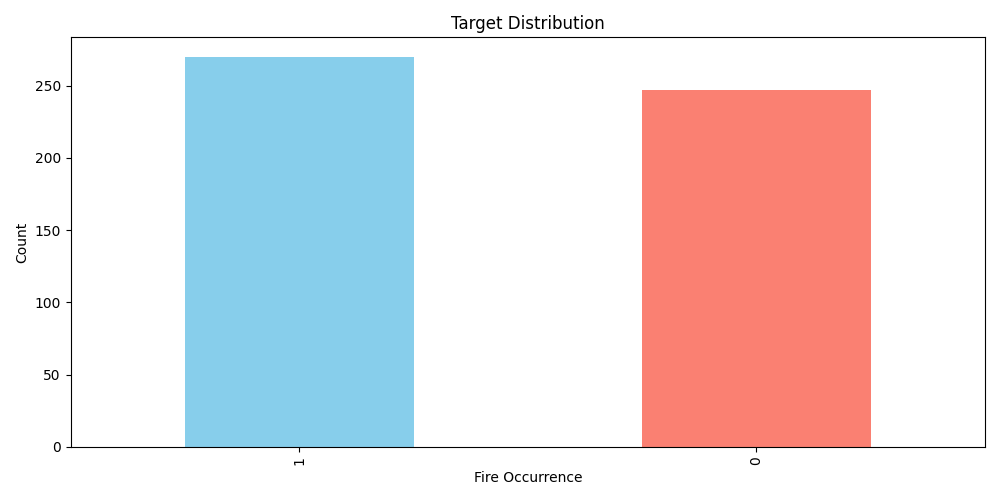
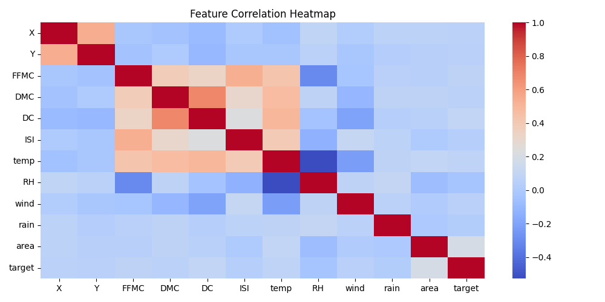
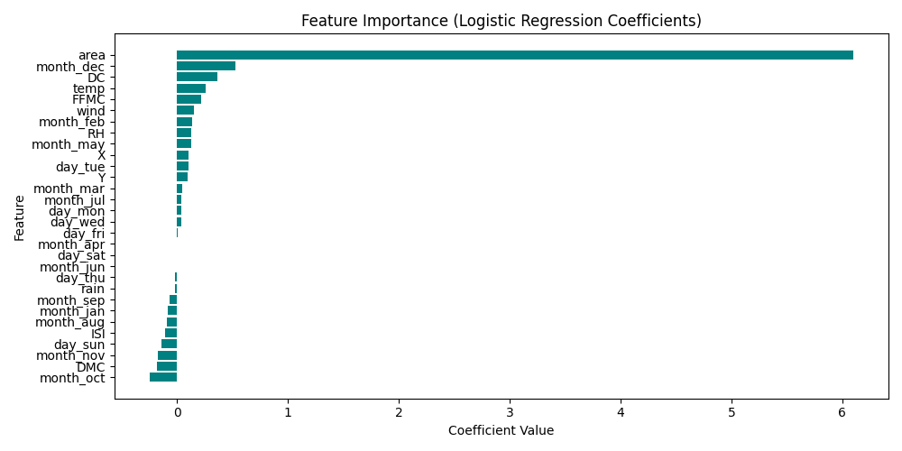
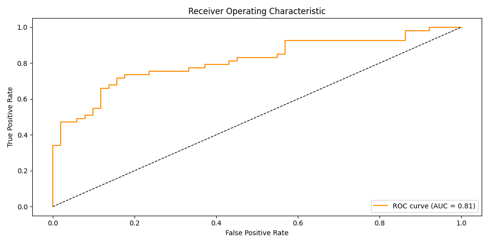
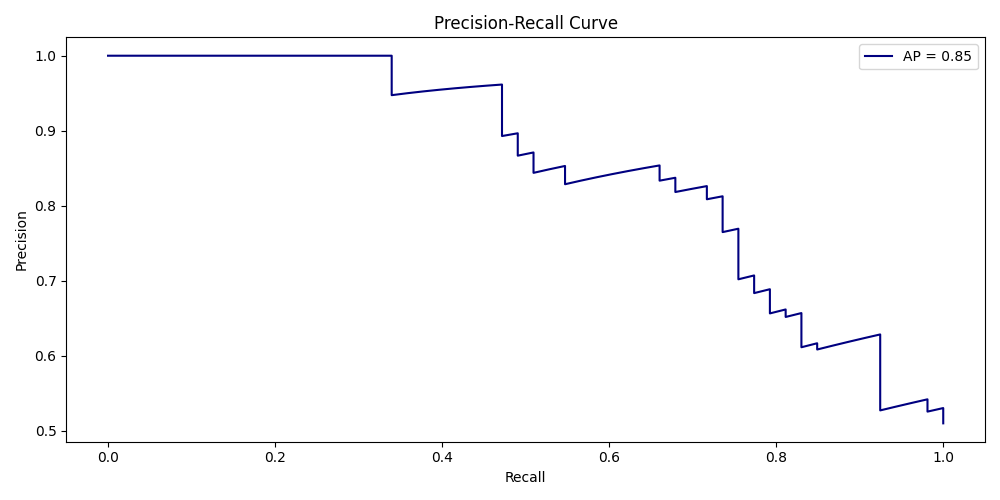
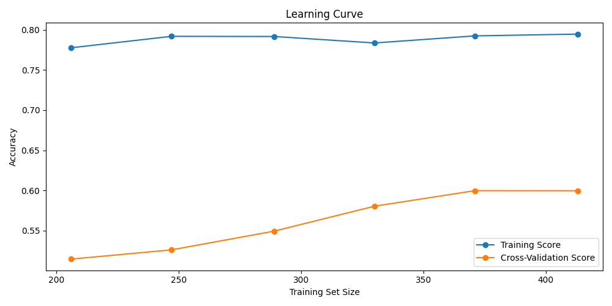
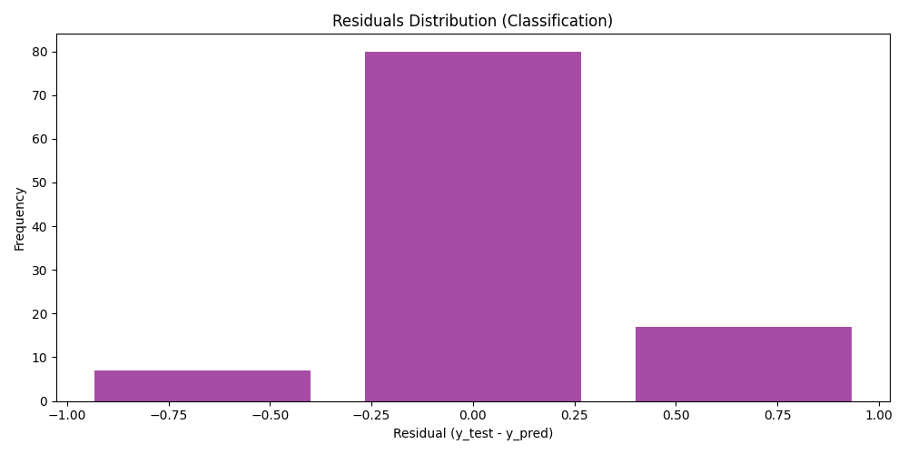
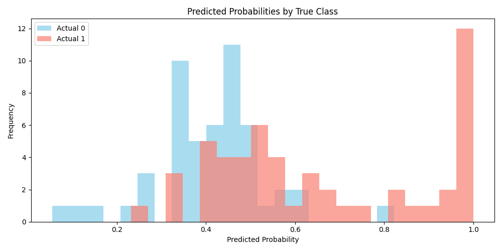
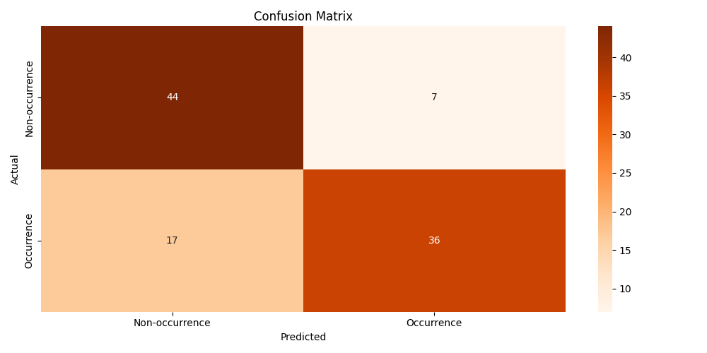

<h1 align="center">Forest Fire Occurrence Prediction</h1>

This project predicts the occurrence of forest fires using a logistic regression model. It uses the [Forest Fires](https://archive.ics.uci.edu/dataset/162/forest+fires) dataset, performs data preprocessing, feature engineering, model training, evaluation, and generates various visualizations to interpret the results.

---

## Visualizations

<table><tr><td>
      <h3 align="center">Target Distribution</h3>
      <i>Shows the count of fire occurrences (target=1) and non-occurrences (target=0) in the dataset. This helps identify class imbalance, which can affect model evaluation and performance.</i>
      
    </td><td>
      <h3 align="center">Correlation Heatmap</h3>
      <i>Displays a heatmap of correlation coefficients between all numeric features. High correlation between features may indicate redundancy and can impact model interpretability.</i>
        </td>
  </tr>
    <tr><td>
      <h3 align="center">Feature Importance</h3>
      <i>Bar chart of logistic regression coefficients for each feature. Features with larger absolute coefficients have a stronger influence on the prediction. Positive values increase the likelihood of fire occurrence, negative values decrease it.</i>
      
    </td><td>
      <h3 align="center">ROC Curve</h3>
      <i>Plots the Receiver Operating Characteristic (ROC) curve, which shows the trade-off between true positive rate and false positive rate at various thresholds. The Area Under the Curve (AUC) summarizes the model's ability to distinguish between classes.</i>
      
    </td></tr>
    <tr><td>
      <h3 align="center">Precision Recall Curve</h3>
      <i>Shows the trade-off between precision and recall for different probability thresholds. Especially useful for imbalanced datasets, this curve helps assess the model's performance in identifying positive cases.</i>
      
    </td><td>
      <h3 align="center">Learning Curve</h3>
      <i>Plots training and cross-validation accuracy as a function of training set size. This helps diagnose whether the model would benefit from more data and whether it is underfitting or overfitting.</i>
      
    </td></tr>
    <tr><td>
      <h3 align="center">Residuals Histogram</h3>
      <i>Histogram of residuals (difference between true and predicted labels). Most values should be zero (correct predictions); nonzero values indicate misclassifications.</i>
      
    </td><td>
      <h3 align="center">Probability Histogram</h3>
      <i>Overlapping histograms of predicted probabilities for each true class. Good separation between the two histograms indicates that the model is confident and effective at distinguishing between classes.</i>
      
    </td></tr>
</table>
<h3 align="center">Confusion Matrix</h3>
      <i>Visualizes the confusion matrix, showing the number of true positives, true negatives, false positives, and false negatives. This provides a detailed breakdown of model prediction outcomes.</i>
      

---

## Project Structure

```bash
.
├── forestfires.csv                 # Dataset
├── forestfires.ipynb               # notebook
├── output/                         # Generated plots and results
│   └── .png 
```

## Dataset

- **Source:** - [Forest Fires](https://archive.ics.uci.edu/dataset/162/forest+fires) dataset
- **Description:** Contains meteorological and temporal features for forest fire events, including:
  - X, Y: Spatial coordinates
  - month, day: Categorical (month and day of observation)
  - FFMC, DMC, DC, ISI: Fire weather indices
  - temp, RH, wind, rain: Weather conditions
  - area: Burned area
  - target: Binary label (1 = fire occurred, 0 = no fire)

## Setup & Installation

1. **Clone the repository**

```sh
  git clone https://github.com/karmaniket/ForestFiresOccurrencePrediction.git
  cd ForestFiresOccurrencePrediction
   ```

2. **Install dependencies**

```sh
   pip install pandas numpy matplotlib seaborn scikit-learn
   ```
---

## Notebook Workflow

1. **Data Loading & Preprocessing**
   - Reads the dataset
   - One-hot encodes categorical features (`month`, `day`)
   - Scales numerical features

2. **Model Training**
   - Splits data into train/test sets
   - Trains a logistic regression model

3. **Evaluation & Visualization**
   - Prints accuracy, confusion matrix, and classification report
   - Plots:
     - Target distribution
     - Feature correlation heatmap
     - Confusion matrix
     - Feature importance (coefficients)
     - ROC curve
     - Precision-recall curve
     - Learning curve
     - Residuals histogram
     - Predicted probability histograms by class

4. **Output**
   - All plots are saved in the `output/` directory for further analysis.

---

## Key Features and Results

- **End-to-end workflow:** From data loading to model evaluation and visualization
- **Extensive visualizations:** For model interpretation and diagnostics
- **Reproducible:** All outputs are generated programmatically and saved for review
- **Model:** Logistic Regression
- **Evaluation Metrics:** Accuracy, confusion matrix, ROC-AUC, precision-recall, feature importance
- **Visual Insights:** Plots help understand model performance, feature effects, and data distribution

---
